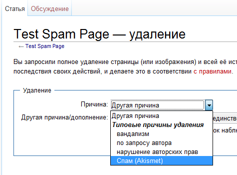

[Версия на русском (оригинал)](README.ru.md)

# AkismetMediawiki
[Mediawiki](https://www.mediawiki.org/wiki/MediaWiki) extention to check changes for spam.

## Config parameters

<table>
    <tbody>
        <tr style="text-align: center;">
            <th>Name</th>
            <th>Default value</th>
            <th>Possible values</th>
            <th>Description</th>
        </tr>
        <tr>
            <th colspan="4">Reqiured fields</th>
        </tr>
        <tr>
            <td>$wgAkismetApiKey</td>
            <td>-</td>
            <td>string</td>
            <td>The Api key, received from akismet.com. The key should be specified.</td>
        </tr>
        <tr>
            <td colspan="4">Enable/disable functionality</td>
        </tr>
        <tr>
            <td>$wgAkismetAddDeleteReason</td>
            <td>true</td>
            <td>true</td>
            <td style="vertical-align: bottom;">Adds an item "Spam (Akismet)" to the  list of reasons during deleting something (a page or a section). With this  item chosen, the deleted page will be sent to the Akismet server as spam.</td>
        </tr>
        <tr>
            <td>$wgAkismetEnableEditFilter</td>
            <td style="text-align: center;">true</td>
            <td style="text-align: center;">true</td>
            <td style="vertical-align: bottom;">Enables checking just edited block.</td>
        </tr>
        <tr>
            <td>$wgAkismetEnableEditFilterMerged</td>
            <td style="text-align: center;">false</td>
            <td style="text-align: center;">true</td>
            <td style="vertical-align: bottom;">Enables checking of the whole article with edited block.</td>
        </tr>
        <tr>
            <th colspan="4">Managing the logic of the work (adjustment, switchers)</th>
        </tr>
        <tr>
            <td rowspan="3">$wgAkismetAuthorIsCreator</td>
            <td rowspan="3" style="text-align: center;">true</td>
            <td style="text-align: center;">&nbsp;</td>
            <td style="vertical-align: bottom;">Defines the author of the article.</td>
        </tr>
        <tr>
            <td style="text-align: center;">true</td>
            <td style="vertical-align: bottom;">Author of the article is considered  as the author of the page.</td>
        </tr>
        <tr>
            <td style="text-align: center;">false</td>
            <td style="vertical-align: bottom;">Author of the article is considered  as the author of the last editing.</td>
        </tr>
        <tr style="font-size:11pt">
            <td rowspan="3">$wgAkismetOnSpamShowEditor</td>
            <td rowspan="3" style="text-align: center;">true</td>
            <td style="text-align: center;">&nbsp;</td>
            <td style="vertical-align: bottom;">Defines the actions to be performed when detecting spam in editing.</td>
        </tr>
        <tr>
            <td style="text-align: center;">true</td>
            <td style="vertical-align: bottom;">Remain on the editing page and show the spam detection message in the heading.</td>
        </tr>
        <tr>
            <td style="text-align: center;">false</td>
            <td style="vertical-align: bottom;">Show the standard page of spam detection.</td>
        </tr>
        <tr>
            <td rowspan="3">$wgAkismetOnSpamShowWikiMessage</td>
            <td rowspan="3" style="text-align: center;">true</td>
            <td style="text-align: center;">&nbsp;</td>
            <td style="vertical-align: bottom;">Defines what message to show in case of spam detection.</td>
        </tr>
        <tr>
            <td style="text-align: center;">true</td>
            <td style="vertical-align: bottom;">Show standard message about spam detection ('spamprotectiontext').</td>
        </tr>
        <tr>
            <td style="text-align: center;">false</td>
            <td style="vertical-align: bottom;">Show the plugin message.</td>
        </tr>
    </tbody>
</table>
