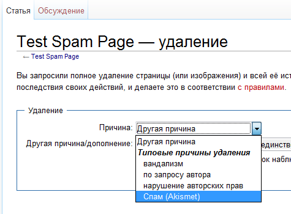

[English version (translated)](README.en.md)

# Важно!!!

Библиотека была написана в 2013 году. Информация описанная здесь может быть (верятнее всего) устарела. Код выложен в качестве примера моего кода для поиска работы. Скорее всего, что сейчас на [Packagist](https://packagist.org/search/?q=akismet) и [оффициальном репозитории плагинов](https://www.mediawiki.org/wiki/Category:Extensions_by_category) вы сможете найти более новые и удобные и качественные расширения для работы с Akismet.

# AkismetMediawiki
Расширение [Mediawiki](https://ru.wikipedia.org/wiki/MediaWiki) для проверки правок на наличие спама.

## Описание параметров

<table>
    <tbody>
        <tr style="text-align: center;">
            <th>Имя</th>
            <th>Значение по умолчанию</th>
            <th>Возможные значения</th>
            <th>Описание</th>
        </tr>
        <tr>
            <th colspan="4">Необходимо для работы</th>
        </tr>
        <tr>
            <td>$wgAkismetApiKey</td>
            <td>-</td>
            <td>строка</td>
            <td>Ключ Api полученный на akismet.com. Должен быть обязательно задан.</td>
        </tr>
        <tr>
            <th colspan="4">Включение/выключение функций</th>
        </tr>
        <tr>
            <td>$wgAkismetAddDeleteReason</td>
            <td>true</td>
            <td>true</td>
            <td style="vertical-align: bottom;">Добавляет на странице удаления к списку причин пунтк "Спам (Akismet), при выборе которого страница будет отправлена на сервер Akismet как спам.</td>
        </tr>
        <tr>
            <td>$wgAkismetEnableEditFilter</td>
            <td style="text-align: center;">true</td>
            <td style="text-align: center;">true</td>
            <td style="vertical-align: bottom;">Включет проверку только текста правки.</td>
        </tr>
        <tr>
            <td>$wgAkismetEnableEditFilterMerged</td>
            <td style="text-align: center;">false</td>
            <td style="text-align: center;">true</td>
            <td style="vertical-align: bottom;">Включет проверку всей
            статьи в которой произошла правка.</td>
        </tr>
        <tr>
            <th colspan="4">Управление логикой работы (настройка, переключатели)</th>
        </tr>
        <tr>
            <td rowspan="3">$wgAkismetAuthorIsCreator</td>
            <td rowspan="3" style="text-align: center;">true</td>
            <td style="text-align: center;">&nbsp;</td>
            <td style="vertical-align: bottom;">Определяет кого считать
            автором статьи.</td>
        </tr>
        <tr>
            <td style="text-align: center;">true</td>
            <td style="vertical-align: bottom;">Автором статьи считается создатель страницы.</td>
        </tr>
        <tr>
            <td style="text-align: center;">false</td>
            <td style="vertical-align: bottom;">Автором статьи считается автор последней правки.</td>
        </tr>
        <tr style="font-size:11pt">
            <td rowspan="3" style="height: 15px;">
            $wgAkismetOnSpamShowEditor</td>
            <td rowspan="3" style="text-align: center;">true</td>
            <td style="text-align: center;">&nbsp;</td>
            <td style="vertical-align: bottom;">Определяет что делать при
            обнаружении спама в правке.</td>
        </tr>
        <tr>
            <td style="text-align: center;">true</td>
            <td style="vertical-align: bottom;">Остаться на странице редактирования и вывести в заголовке сообщение об обнаружении спама.</td>
        </tr>
        <tr>
            <td style="text-align: center;">false</td>
            <td style="vertical-align: bottom;">Показать стандартную страницу обнаружения спама.</td>
        </tr>
        <tr>
            <td rowspan="3">$wgAkismetOnSpamShowWikiMessage</td>
            <td rowspan="3" style="text-align: center;">true</td>
            <td style="text-align: center;">&nbsp;</td>
            <td style="vertical-align: bottom;">Определяет какое именно сообщение показать в случае обнаружения спама.</td>
        </tr>
        <tr>
            <td style="text-align: center;">true</td>
            <td style="vertical-align: bottom;">Показать стандартное сообщение об обнаружении спама ('spamprotectiontext').</td>
        </tr>
        <tr>
            <td style="text-align: center;">false</td>
            <td style="vertical-align: bottom;">Показать сообщение плагина.</td>
        </tr>
    </tbody>
</table>
